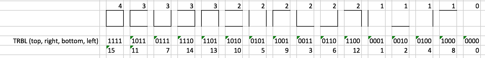

# trailz

> A library for generating mazes

[](https://circleci.com/gh/jmquigley/trailz/tree/master)
[](https://palantir.github.io/tslint/)
[](https://github.com/avajs/ava)
[](https://www.npmjs.com/package/trailz)
[](https://coveralls.io/github/jmquigley/trailz?branch=master)

This library is based on the algorithms from the book [Mazes for Programmers: Code Your Own Twisty Little Passages](https://www.amazon.com/Mazes-Programmers-Twisty-Little-Passages/dp/1680500554/ref=sr_1_1?ie=UTF8&qid=1503783819&sr=8-1&keywords=Mazes+for+programmers), by Jamis Buck


## Requirements

- [Node](https://nodejs.org/en/) v7.5+
- [Yarn](https://yarnpkg.com) v0.28.4


## Installation

This module uses [yarn](https://yarnpkg.com/en/) to manage dependencies and run scripts for development.

To install as an application dependency:
```
$ yarn add trailz
```

To install as a global dependency for CLI use (options below):
```
$ yarn global add trailz
```

To build the app and run all tests:
```
$ yarn run all
```


## Overview

To use the library create an instance of the `Maze` class with the size requirements and algorithm type.  It will automatically generate the maze and save it within a grid.  The contents of the maze can be retrieved by using the `.string` or `.repr` properties to get the contents.  The `.string` will give an ASCII string representation of the maze.  The `.repr` method will return a two dimensional array that contains the representation of that cell.  This representation is 1 of 16 possible representations for a cell (for drawing purposes).

```
+---+---+---+---+---+---+---+---+---+---+
|                                       |
+---+   +   +   +   +   +   +---+---+   +
|       |   |   |   |   |   |           |
+---+---+   +   +   +---+---+---+---+   +
|           |   |   |                   |
+   +---+---+   +---+   +---+   +---+   +
|   |           |       |       |       |
+---+---+---+---+   +   +   +   +---+   +
|                   |   |   |   |       |
+---+   +   +   +---+---+   +   +   +   +
|       |   |   |           |   |   |   |
+---+---+   +   +   +   +---+---+---+   +
|           |   |   |   |               |
+   +---+   +   +---+   +---+   +---+   +
|   |       |   |       |       |       |
+   +   +---+---+   +---+   +---+---+   +
|   |   |           |       |           |
+   +   +   +---+   +---+---+   +   +   +
|   |   |   |       |           |   |   |
+---+---+---+---+---+---+---+---+---+---+

 11,  8,  8,  8,  8,  8,  8, 10, 10, 12
 11,  6,  5,  5,  5,  7,  7, 11, 10,  4
  9, 10,  6,  5,  7,  9, 10,  8, 10,  4
  7, 11, 10,  6,  9,  4,  9,  4, 11,  4
 11,  8,  8,  8,  6,  7,  5,  5,  9,  4
 11,  6,  5,  5,  9,  8,  6,  7,  7,  5
  9, 10,  4,  5,  7,  5, 11,  8, 10,  4
  5,  9,  6,  7,  9,  6,  9,  6, 11,  4
  5,  5,  9, 10,  4, 11,  6,  9,  8,  4
  7,  7,  7, 11,  6, 11, 10,  6,  7,  7
```




### Usage

```javascript
import {AlgorithmType, Maze} from 'trailz';

const maze = new Maze(10, 10, AlgorithmType.BinaryTree);
console.log(maze.string);
```

This will create a new instance of a maze using the BinaryTree algorithm.  A new instance of the maze can be rebuilt without creating a new instance with:

```javascript
maze.rebuild(AlgorithmType.BinaryTree);
```

This will reset the grid and reapply the BinaryTree algorithm to the grid.  The grid can be resized and rebuilt too.

```javascript
maze.resize(5, 5)
```

This will resize the grid to a 5x5 maze and reapply the algorithm.

### CLI

The command line interface allows one to create mazes and print their contents to a text file.

```
$ trailz -r 25 -c 25 -a Sidewinder --verbose -o maze.txt
```

This will create a 25x25 maze using the [Sidewinder](docs/lib/sidewinder.md) algorithm.  The contents will be printed to the terminal and also written to a file named `maze.txt` (the default).

##### Arguments

- `-r|--rows {#}` - the number of rows to create in the maze.  The default is 10.
- `-c|--cols {#}` - the number of columns to create in the maze.  The default is 10.
- `-a|--algorithm {name}` - the string name of the algorithm to use when generating the maze (see the list below).  The current default is the `BinaryTree` algorithm.
- `-v|--verbose` - will dump the contents of the generated maze to stdout.  Not shown by default.
- `-o|--output {filename}` - where to dump the contents of the maze (text file).  The file `maze.txt` is used by default and will be overwritten on successive runs.


## API

- [Cell](docs/lib/cell.md)
- [Grid](docs/lib/grid.md)
- [Maze](docs/lib/maze.md)
- [Algorithm](docs/lib/algorithm.md)

## Algorithms

- [AldousBroder](docs/lib/aldousbroder.md)
- [BinaryTree](docs/lib/binarytree.md)
- [HuntAndKill](docs/lib/huntandkill.md)
- [RecursiveBacktracker](docs/lib/recursivebacktracker.md)
- [Sidewinder](docs/lib/sidewinder.md)
- [Wilsons](docs/lib/wilsons.md)
